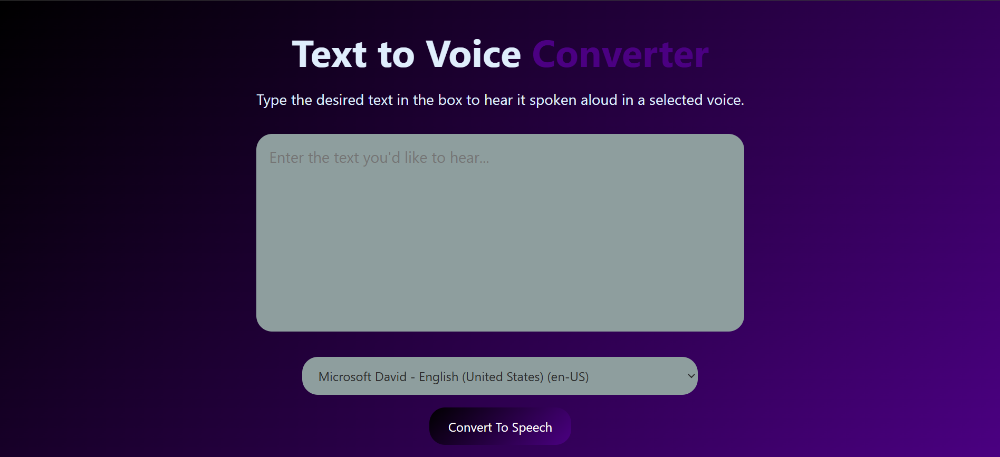

# 🗣️ Text to Voice Converter

A simple and responsive web application that converts written text into spoken words using the browser's built-in speech synthesis (Text-to-Speech) API. Designed with a modern UI featuring a black and indigo gradient theme.

## 🚀 Demo

## 🎯 Features

- 🎤 Convert any text into speech using browser-supported voices.
- 🌍 Choose from available voices/languages installed on your device.
- 🎨 Stylish and responsive UI with a dark and gradient aesthetic.
- 🧠 Built with HTML, CSS, and vanilla JavaScript.
- 🔊 Supports most modern browsers with SpeechSynthesis API support.
